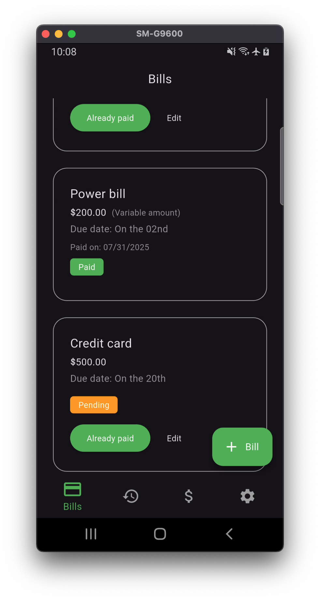
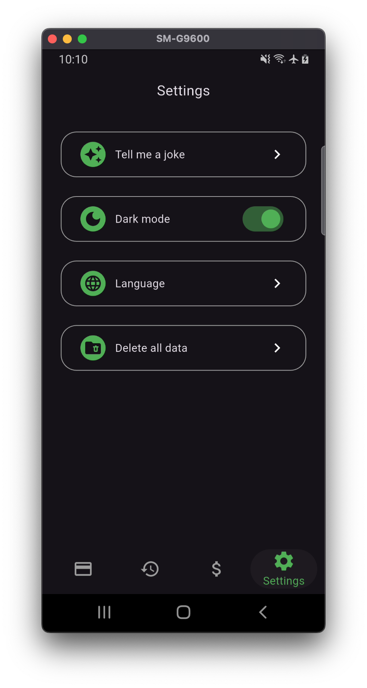

# 💸 Already paid (Já paguei 🇧🇷) – A Simple Flutter App to Manage Monthly Payments

This Flutter app helps users **manually track and manage their monthly bills** by storing important payment information, alerting them to upcoming due dates, and providing a clean history and balance visualization.

The idea came from a need I encountered in my daily life — I always needed a simple app to manage my bills, but the available apps were overly complex. As a result, I ended up using to-do list apps, which was a very manual and inefficient solution for this purpose.


> ⚠️ Note: This app **does not connect to banks** or process real payments. It is purely for personal financial tracking.

> 🌎 App compatible languages: 🇺🇸 English 🇺🇸 ; 🇧🇷 Portuguese 🇧🇷 

---

## 📱 Features

- Local database (no internet needed)
- UI reusable components
- Lottie animations (SplashScreen and LoaderOverlay)
- Create, Update, Edit and Delete bills (CRUD)
- Mark bills as **paid**, with optional value updates for variable amount and payment date
- View bill list sorted by due date, always showing the last 5 days first and then upcoming bills in ascending order
- Assign different **payment methods** (BankSlip, Debit, Money, etc.)
- Track bill **status**: Pending, Paid, or Overdue
- View **payment history** by months
- See a **bar chart** of total expenses over the past 6 months
- Dark mode and Light mode from device and also user user-changeable (saved to local storage)
- Language selection based on device settings, and also user-changeable (saved to local storage)
- Delete all data
- Tell me a joke (funny feature of the app using open JokeAPI https://sv443.net/jokeapi/v2/)

---

## 📸 Screenshots

|   |   |   |   |   | 
|---|---|---|---|---|
|    |    |   |   |   |
|   |   |   |   |   |


---

## 🧱 Tech Stack

- **Flutter** – Cross-platform UI (Initially developed in Flutter 3.32.7)
- **Local data persistence** – sqlite, path
- **State Management:** - provider
- **Date and currency formatting** - intl, currency_text_input_formatter
- **Bar charts** - fl_chart
- **For light storage needs** - shared_preferences
- **Localizations** - flutter_localizations
- **Http** - dio, dart_either
- **Unit testing** - equatable
- **Other visual libs** - stylish_bottom_bar, table_calendar, top_snackbar_flutter, modal_bottom_sheet, lottie, loader_overlay

---

## 📁 Folder Structure
Based on Flutter documentation (https://docs.flutter.dev/app-architecture/guide) with some minor changes
```bash
lib/
├── core/
│ ├── constants/ # consts
│ ├── extensions/ # date_time, locale, navigator, presentation, string
│ ├── ui/ # JP UI visual components
├── data/ 
│ ├── datasources/ # remote datasources and local databases
│ ├── errors/ # exceptions and failures
│ ├── models/ # app classes
│ ├── services/ # remote datasources connections using either returns
├── presentation/
│ ├── pages/ # screens
│ ├── widgets/ # reusable internal UI components
│ └── enums/ # status and models enums
│ └── routes/ # page routes for navigation 
│ └── state/ # view_models 
└── l10n/ # localization files, keys and values
```

---

## 🚀 Getting Started

1. **Clone the repository:**

   ```bash
   git clone https://github.com/yourusername/ja_paguei.git
   cd ja_paguei
   
2. **Install dependencies:**
   
   ```bash
   flutter pub get
   
3. **Run the app:**
   
   ```bash
   flutter run

---

## 🔐 Privacy & Security
All data is stored locally on the user’s device.
No data is shared, uploaded, or monetized.

---

## 📄 License
This project is open-source and available under the MIT License (https://opensource.org/license/mit).

---

## 🙌 Contributing
Contributions are welcome! Feel free to fork this repo and submit a pull request.

---

## 📬 Contact
Created by Raphael Bassani
Feel free to reach out on LinkedIn or open an issue. 
https://www.linkedin.com/in/raphaelbassani/


